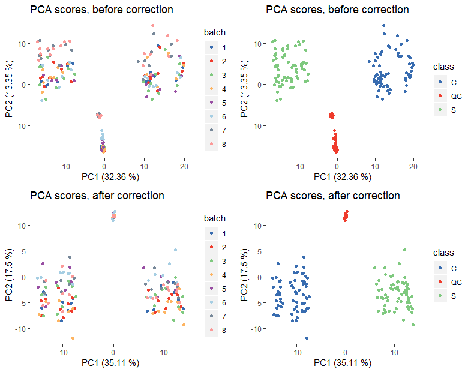

========================================================
SBCMS: Signal and Batch Correction for Mass Spectrometry
========================================================

|Git| |Bioconda| |Build Status (Travis)| |License| |Coverage| |mybinder|

.. contents::
  :local:

-------------
Installation
-------------

Github
------------

.. code-block:: r

  install.packages("devtools")
  install.packages("ggplot2")
  install.packages("gridExtra")
  install.packages("reshape2")

  devtools::install_github("computational-metabolomics/pmp", build_vignettes=TRUE)
  devtools::install_github('computational-metabolomics/sbcms',
    build_vignettes=TRUE)

Conda
------------

.. code-block:: command

   conda create -n sbcms bioconductor-sbcms -c conda-forge -c bioconda
    -c computational-metabolomics
  source activate sbcms

------------
Example
------------

.. code-block:: r

  library(sbcms)
  library(pmp)

  # DIMS data set is included in 'sbcms' package
  # (MTBLS79) [https://www.ebi.ac.uk/metabolights/MTBLS79]
  data <- sbcdata$data
  class <- sbcdata$class
  batch <- sbcdata$batch
  sample_order <- c(1:nrow(data))

  # Input data frame or matrix should have features in rows and samples in columns
  data <- t(data)

  corrected_data <- sbcms::QCRSC(df=data, order=sample_order, batch=batch,
    classes=class, spar=0, minQC=4)

  # Create PDF file comparing data before and after correction fo the first 100 features
  sbcms::plot_sbc(df=data, corrected_df=corrected_data, classes=class,
    batch=batch, order=order, output="Correction_summary.pdf")

  #Principal components analysis (PCA) before and after drift correction

  library(ggplot2)
  library(gridExtra)

  manual_color=c("#386cb0", "#ef3b2c", "#7fc97f", "#fdb462", "#984ea3",
    "#a6cee3", "#778899", "#fb9a99", "#ffff33")

  # PQN used to normalise data
  # KNN for missing value imputation
  # glog scaling
  # A more detailed overview is detailed in Di Guida et al, Metabolomics, 12:93, 2016
  # https://dx.doi.org/10.1007/s11306-016-1030-9

  pca_data <- pmp::pqn_normalisation(data, classes=class, qc_label="QC")[[1]]
  pca_data <- pmp::mv_imputation(pca_data, method="KNN", k=5, rowmax=5, colmax=5, check_df=F)
  pca_data <- pmp::glog_transformation(pca_data, classes=class, qc_label="QC")

  pca_corrected_data <- pmp::pqn_normalisation(corrected_data, classes=class, qc_label="QC")[[1]]
  pca_corrected_data <- pmp::mv_imputation(pca_corrected_data, method="KNN", k=5, rowmax=5, colmax=5, check_df=F)
  pca_corrected_data <- pmp::glog_transformation(pca_corrected_data, classes=class, qc_label="QC")

  pca_data <- prcomp(t(pca_data), center=T, scale=F)
  pca_corrected_data <- prcomp(t(pca_corrected_data), center=T, scale=F)

  exp_var_pca <- round(((pca_data$sdev^2)/sum(pca_data$sdev^2)*100)[1:2],2)
  exp_var_pca_corrected <- round(((pca_corrected_data$sdev^2)/sum(pca_corrected_data$sdev^2)*100)[1:2],2)

  plots <- list()

  plotdata <- data.frame(PC1=pca_data$x[, 1], PC2=pca_data$x[, 2], batch=as.factor(batch),
    class=class)

  plots[[1]] <- ggplot(data=plotdata, aes(x=PC1, y=PC2, col=batch))+ geom_point()+
    theme(panel.background=element_blank())+
    scale_color_manual(values=manual_color)+
    ggtitle("PCA scores, before correction")+
    xlab(paste0("PC1 (", exp_var_pca[1] ," %)"))+
    ylab(paste0("PC2 (", exp_var_pca[2] ," %)"))

  plots[[2]] <- ggplot(data=plotdata, aes(x=PC1, y=PC2, col=class))+ geom_point()+
    theme(panel.background=element_blank())+
    scale_color_manual(values=manual_color)+
    ggtitle("PCA scores, before correction")+
    xlab(paste0("PC1 (", exp_var_pca[1] ," %)"))+
    ylab(paste0("PC2 (", exp_var_pca[2] ," %)"))

  plotdata_corr <- data.frame(PC1=pca_corrected_data$x[, 1], PC2=pca_corrected_data$x[, 2],
  batch=as.factor(batch), class=class)

  plots[[3]] <- ggplot(data=plotdata_corr, aes(x=PC1, y=PC2, col=batch))+ geom_point()+
    theme(panel.background=element_blank())+
    scale_color_manual(values=manual_color)+
    ggtitle("PCA scores, after correction")+
    xlab(paste0("PC1 (", exp_var_pca_corrected[1] ," %)"))+
    ylab(paste0("PC2 (", exp_var_pca_corrected[2] ," %)"))

  plots[[4]] <- ggplot(data=plotdata_corr, aes(x=PC1, y=PC2, col=class))+ geom_point()+
    theme(panel.background=element_blank())+
    scale_color_manual(values=manual_color)+
    ggtitle("PCA scores, after correction")+
    xlab(paste0("PC1 (", exp_var_pca_corrected[1] ," %)"))+
    ylab(paste0("PC2 (", exp_var_pca_corrected[2] ," %)"))

  grid.arrange(ncol=2, plots[[1]], plots[[2]], plots[[3]], plots[[4]])

------------
Tutorials
------------

For step by step tutorial on how to assess and/or correct signal drift and batch
effects within/across a multi-batch liquid chromatography mass
spectrometry (LCMS) dataset using SBCMS please check R package vignettes.

.. code-block:: r

  browseVignettes("sbcms")

------------
References
------------

.. |Build Status (Travis)| image:: https://img.shields.io/travis/computational-metabolomics/sbcms/master.svg?label=Travis
   :target: https://travis-ci.org/computational-metabolomics/sbcms

.. |Build Status (AppVeyor)| image:: https://ci.appveyor.com/api/projects/status/github/computational-metabolomics/sbcms?branch=master&svg=true
   :target: https://ci.appveyor.com/project/computational-metabolomcis/sbcms

.. |Git| image:: https://img.shields.io/badge/repository-GitHub-blue.svg?style=flat&maxAge=3600
   :target: https://github.com/computational-metabolomics/sbcms

.. |Bioconda| image:: https://img.shields.io/badge/install%20with-bioconda-brightgreen.svg?style=flat&maxAge=3600
   :target: https://bioconda.github.io/recipes/bioconductor-sbcms/README.html

.. |License| image:: https://img.shields.io/badge/licence-GNU_v3-teal.svg?style=flat&maxAge=3600
   :target: https://www.gnu.org/licenses/gpl-3.0.html

.. |Coverage| image:: https://codecov.io/gh/computational-metabolomics/sbcms/branch/master/graph/badge.svg
   :target: https://codecov.io/github/computational-metabolomics/sbcms?branch=master

.. |mybinder| image:: https://mybinder.org/badge_logo.svg
   :target: https://mybinder.org/v2/gh/computational-metabolomics/sbcms/master?filepath=notebooks
