This is a step by step tutorial on how to assess and/or correct signal drift and batch effects within/across a multi-batch direct infusion mass spectrometry (DIMS) dataset using the R package SBCMS (Signal & Batch Correction for Mass Spectrometry). The same approach can be used on liquid chromatography mass spectrometry (LCMS) peak table as well.

This tutorial assumes that you have basic R scripting skills. Here are some other resources you might find useful:

[R introduction](http://www.r-tutor.com/r-introduction)

[Reshaping Data](https://www.statmethods.net/management/reshape.html)

[Creating graphics with ggplot2](http://r-statistics.co/Complete-Ggplot2-Tutorial-Part1-With-R-Code.html)

[ggplot2 practical guide](http://www.sthda.com/english/wiki/be-awesome-in-ggplot2-a-practical-guide-to-be-highly-effective-r-software-and-data-visualization)

[R cheat sheet](http://github.com/rstudio/cheatsheets/raw/master/base-r.pdf)

[ggplot2 cheat sheet](cheatsheet%20https://www.rstudio.com/wp-content/uploads/2015/03/ggplot2-cheatsheet.pdf)

Installation
============

You should have R version 3.4.1 or above and Rstudio installed to be able to run this notebook.

Execute following commands from the R terminal.

``` r
install.packages("devtools", repos="https://www.stats.bris.ac.uk/R/")
install.packages("ggplot2", repos="https://www.stats.bris.ac.uk/R/")
install.packages("gridExtra", repos="https://www.stats.bris.ac.uk/R/")
install.packages("reshape2", repos="https://www.stats.bris.ac.uk/R/")

devtools::install_github("computational-metabolomics/pmp/tree/v0.2.2")
devtools::install_github("computational-metabolomics/sbcms")
```

Load the required libraries into the R environment

``` r
library(sbcms)
library(ggplot2)
library(reshape2)
library(gridExtra)
library(pmp)
```

    ## 
    ## Attaching package: 'pmp'

    ## The following object is masked from 'package:sbcms':
    ## 
    ##     testData

Data set
========

We will be using a small subset of 20 features of an DIMS data set consisting of 172 samples measured across 8 batches. More detailed description of the data set is available from [Kirwan et al, Scientific Data, 1, 140012 (2014)](https://www.nature.com/articles/sdata201412) and \[MTBLS79\] (<https://www.ebi.ac.uk/metabolights/MTBLS79>)

``` r
summary(sbcdata$data[, seq(1, 2000, 100)])
```

    ##     70.03364       133.07379        146.16519        163.04515     
    ##  Min.   : 2390   Min.   :214680   Min.   : 20142   Min.   : 85138  
    ##  1st Qu.:15107   1st Qu.:326793   1st Qu.: 43129   1st Qu.:140682  
    ##  Median :25992   Median :364517   Median : 57957   Median :153265  
    ##  Mean   :25715   Mean   :355800   Mean   : 73911   Mean   :154682  
    ##  3rd Qu.:35395   3rd Qu.:389726   3rd Qu.: 85819   3rd Qu.:170635  
    ##  Max.   :56061   Max.   :452978   Max.   :351751   Max.   :216917  
    ##  NA's   :18                                                        
    ##    174.89483       200.03196       207.07818        221.05062     
    ##  Min.   : 6839   Min.   :18338   Min.   :179175   Min.   : 52204  
    ##  1st Qu.:11551   1st Qu.:24673   1st Qu.:206967   1st Qu.: 86777  
    ##  Median :14079   Median :28380   Median :220686   Median : 96552  
    ##  Mean   :16982   Mean   :30027   Mean   :225574   Mean   : 96794  
    ##  3rd Qu.:21159   3rd Qu.:33026   3rd Qu.:234812   3rd Qu.:105478  
    ##  Max.   :43762   Max.   :58147   Max.   :431784   Max.   :131368  
    ##                                                                   
    ##    240.02445       251.03658        266.01793       304.99115     
    ##  Min.   :12994   Min.   :  4726   Min.   : 5283   Min.   : 24683  
    ##  1st Qu.:22179   1st Qu.: 20658   1st Qu.:14247   1st Qu.: 44669  
    ##  Median :28939   Median : 30675   Median :30224   Median : 60338  
    ##  Mean   :29429   Mean   : 41251   Mean   :26680   Mean   : 68689  
    ##  3rd Qu.:34527   3rd Qu.: 58220   3rd Qu.:36028   3rd Qu.: 80126  
    ##  Max.   :54417   Max.   :164754   Max.   :61402   Max.   :190193  
    ##                  NA's   :32       NA's   :30                      
    ##    321.07923        338.98131       376.03962       393.35878     
    ##  Min.   :  5368   Min.   : 2817   Min.   : 7082   Min.   : 62973  
    ##  1st Qu.: 16107   1st Qu.: 6413   1st Qu.:17636   1st Qu.:123464  
    ##  Median : 27822   Median : 8215   Median :22720   Median :166579  
    ##  Mean   : 38301   Mean   : 9494   Mean   :24130   Mean   :235819  
    ##  3rd Qu.: 46408   3rd Qu.:11087   3rd Qu.:28685   3rd Qu.:334867  
    ##  Max.   :285756   Max.   :30462   Max.   :67877   Max.   :830668  
    ##  NA's   :27       NA's   :29                                      
    ##    409.05716         430.24353        451.01086       465.14937     
    ##  Min.   : 110970   Min.   : 25415   Min.   : 1884   Min.   :  3167  
    ##  1st Qu.: 151404   1st Qu.: 34350   1st Qu.: 5254   1st Qu.: 19916  
    ##  Median : 161617   Median : 38528   Median : 7210   Median : 25224  
    ##  Mean   : 183870   Mean   : 43203   Mean   : 7880   Mean   : 27209  
    ##  3rd Qu.: 174052   3rd Qu.: 43726   3rd Qu.:10490   3rd Qu.: 29656  
    ##  Max.   :2828059   Max.   :121995   Max.   :17602   Max.   :101471  
    ##                                     NA's   :1       NA's   :9

``` r
#number of samples:
nrow(sbcdata$data)
```

    ## [1] 172

``` r
#Batches:
unique(sbcdata$batch)
```

    ## [1] 1 2 3 4 5 6 7 8

``` r
#Sample classes:
unique(sbcdata$class)
```

    ## [1] "QC" "C"  "S"

Explorative example
===================

A more detailed overview and guidelines on strategies for quality control of mass spectrometry assays is detailed in recent work by \[Broadhurst et al, Metabolomics, 14:72, 2018.\] (<http://dx.doi.org/10.1007/s11306-018-1367-3>)

To evaluate if the data needs correction, it is common practice to examine the relative standard deviation (RSD) of the quality control (QC) samples and biological samples. RSD% is also sometimes referred to as the coefficient of variation (CV). An RSD% for the QC samples below 20-30% is commonly used as an acceptable level of technical variation where signal correction is not required.

The following code calculates and plots the RSD% values of the features within the data set.

``` r
#  separate the LCMS data from the meta data
data <- sbcdata$data[, seq(1, 2000, 100)]
class <- sbcdata$class
batch <- sbcdata$batch
order <- c(1:nrow(data))

# get index of QC samples
QChits <- which(class == "QC")

# small function to calculate RSD%
FUN <- function(x) sd(x, na.rm=T) / mean(x, na.rm=T) * 100

# RSD% of biological and QC samples within all 6 batches:
out <- matrix(ncol=2, nrow=ncol(data))
colnames(out) <- c("Sample","QC")
rownames(out) <- colnames(data)

# for each feature calculate RSD% for the samples and the QCs
for (i in 1:ncol(data)) {
  
  out[i, 1] <- FUN(data[-QChits, i]) # for samples
  out[i, 2] <- FUN(data[QChits, i]) # for QCs
}

# prepare data for plotting
plotdata <- melt(data.frame(out), variable.name="Class", value.name="RSD")
plotdata$feature <- colnames(data)

plotdata$RSD <- round(plotdata$RSD,0)
plotdata$feature <- factor(plotdata$feature, ordered=T, levels=unique(plotdata$feature))

# plot
ggplot(data=plotdata, aes(x=Class, y=feature, fill=RSD))+ 
  geom_tile()+ 
  geom_text(aes(label=RSD))+
  scale_fill_gradient2(low="black", mid="white", high="red")
```

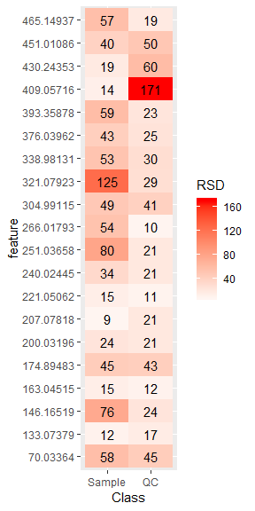

A violin plot is a useful way of summarising the RSD% over all samples/QCs in the data set. Note a very high QC sample RSD% value for feature '409.05716'.

``` r
ggplot(data=plotdata, aes(x=Class, y=RSD, fill=Class))+ geom_violin(draw_quantiles=c(0.25,0.5,0.75))+
  ylab("RSD%")+ 
  theme(panel.background=element_blank())
```

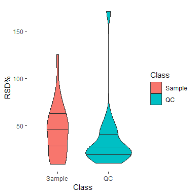

The plots indicates that there are some features with a QC RSD% lower than 30%, which is a commonly accepted threshold, but for some features QC RSD % exceeds 30% and is similar to the signal variation of the biological samples. We can calculate similar statistics per batch and visualise the results with a box plot.

``` r
# prepare some matrices to store the results
RSDQC <- matrix(ncol=8, nrow=ncol(data))
RSDsample <- matrix(ncol=8, nrow=ncol(data))
colnames(RSDQC) <- unique(batch)
colnames(RSDsample) <- unique(batch)

rownames(RSDQC) <- colnames(data)
rownames(RSDsample) <- colnames(data)

# for each feature
for (i in 1:ncol(data)) {
  
  # for each batch
  for (nb in 1:8) {
    
    RSDQC[i, nb] <- FUN(data[which(class == "QC" & batch == nb), i]) # RSD% of QCs in this batch
    RSDsample[i, nb] <- FUN(data[which(!class == "QC" & batch == nb), i]) # RSD% of samples in this batch
  }
}

# prepare results for plotting
plotdataQC <- melt(as.data.frame(RSDQC), variable.name="batch", value.name="RSD")
plotdataQC$Class <- "QC"

plotdataBio <- melt(as.data.frame(RSDsample), variable.name="batch", value.name="RSD")
plotdataBio$Class <- "Sample"

plotdata <- rbind(plotdataQC, plotdataBio)

plotdata$Class <- as.factor(plotdata$Class)

# plot
ggplot(data=plotdata, aes(x=Class, y=RSD, fill=Class))+ geom_boxplot()+
  facet_wrap(~ batch, ncol=3)+
  ylab("RSD%")+
  theme(panel.background=element_blank())
```

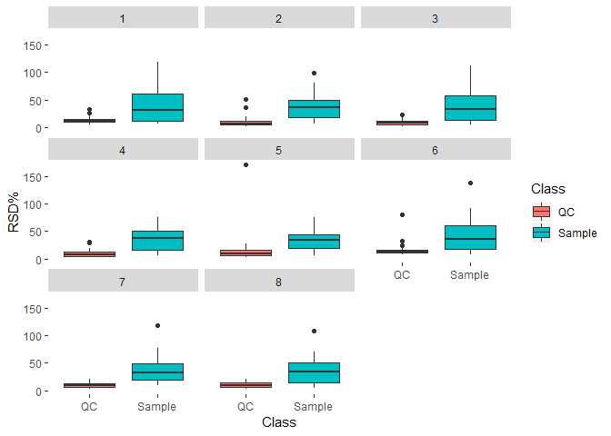

**Summary of RSD% of QC samples**

``` r
summary(RSDQC)
```

    ##        1                2                3                4         
    ##  Min.   : 5.494   Min.   : 1.544   Min.   : 1.253   Min.   : 2.242  
    ##  1st Qu.: 9.390   1st Qu.: 5.139   1st Qu.: 5.318   1st Qu.: 4.828  
    ##  Median :11.940   Median : 6.895   Median : 7.585   Median : 7.729  
    ##  Mean   :13.850   Mean   :11.106   Mean   : 9.513   Mean   :10.728  
    ##  3rd Qu.:14.824   3rd Qu.:12.203   3rd Qu.:12.187   3rd Qu.:13.141  
    ##  Max.   :33.582   Max.   :51.256   Max.   :23.322   Max.   :31.683  
    ##        5                 6                7                8         
    ##  Min.   :  2.254   Min.   : 7.432   Min.   : 2.553   Min.   : 2.640  
    ##  1st Qu.:  6.775   1st Qu.:11.348   1st Qu.: 6.403   1st Qu.: 6.462  
    ##  Median : 10.094   Median :13.542   Median : 9.571   Median : 8.557  
    ##  Mean   : 19.690   Mean   :17.684   Mean   : 9.285   Mean   :10.252  
    ##  3rd Qu.: 16.091   3rd Qu.:16.199   3rd Qu.:12.397   3rd Qu.:13.754  
    ##  Max.   :170.303   Max.   :79.814   Max.   :20.479   Max.   :20.977

**Summary of RSD% of biological samples**

``` r
summary(RSDsample)
```

    ##        1                 2                3                 4         
    ##  Min.   :  6.746   Min.   : 6.604   Min.   :  4.211   Min.   : 5.679  
    ##  1st Qu.: 10.896   1st Qu.:17.282   1st Qu.: 12.397   1st Qu.:16.656  
    ##  Median : 30.560   Median :36.431   Median : 32.848   Median :37.214  
    ##  Mean   : 38.338   Mean   :37.854   Mean   : 39.372   Mean   :37.242  
    ##  3rd Qu.: 61.465   3rd Qu.:49.282   3rd Qu.: 57.670   3rd Qu.:50.813  
    ##  Max.   :117.884   Max.   :98.010   Max.   :112.353   Max.   :74.824  
    ##        5                6                 7                 8          
    ##  Min.   : 6.412   Min.   :  8.684   Min.   :  9.647   Min.   :  4.821  
    ##  1st Qu.:18.916   1st Qu.: 17.918   1st Qu.: 18.379   1st Qu.: 14.845  
    ##  Median :34.609   Median : 36.553   Median : 31.890   Median : 33.948  
    ##  Mean   :33.461   Mean   : 43.971   Mean   : 37.071   Mean   : 36.726  
    ##  3rd Qu.:43.464   3rd Qu.: 59.891   3rd Qu.: 49.187   3rd Qu.: 50.618  
    ##  Max.   :76.129   Max.   :138.689   Max.   :117.526   Max.   :108.413

From the above we can conclude that for every analytical batch RSD% tends to be higher in the analytical samples than it is in the QC samples for all 20 measured features. A few outlier QC samples can be observed.

An alternative measure of QC and biological sample variability is the so called d-ratio, which indicates if the technical variation within the QC samples exceeds the biological variation within biological samples.

``` r
# prepare a list of colours for plotting
manual_color=c("#386cb0","#ef3b2c","#7fc97f","#fdb462","#984ea3","#a6cee3","#778899","#fb9a99","#ffff33")

# Function to calculate median absolute deviation
DRatfun <- function(samples, qcs) mad(qcs) / mad(samples)

# prepare matrix for dratio output
dratio <- matrix(ncol=8, nrow=ncol(data))
colnames(dratio) <- unique(batch)
rownames(dratio) <- colnames(data)

# calculate dratio for each feature, per batch
for (i in 1:nrow(dratio)){
  for (nb in 1:8) {
    dratio[i, nb] <- DRatfun(samples=data[which(!class == "QC" & batch == nb), i], qcs=data[which(class == "QC" & batch == nb), i])
  }
}

# prepare data for plotting
dratio <- as.data.frame(round(dratio, 2))

plotdata2 <- melt(dratio, variable.name="batch")
plotdata2$index <- colnames(data)
plotdata2$index <- factor(plotdata2$index, ordered=T, levels=unique(plotdata2$index))

qplot(x=index, y=value, color=batch, data=plotdata2, geom="point", xlab="index", ylab="D-ratio")+ 
  geom_hline(yintercept=1)+ theme(panel.background=element_blank())+
  scale_color_manual(values=manual_color)+theme(axis.text.x=element_text(angle=90))
```

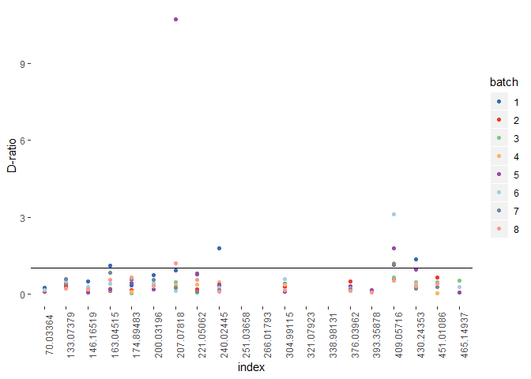

The D-ratio is a convenient measure to assess if technical variation in the QC samples (MAD QC) is higher than the variation within the biological samples (MAD sample). Ratio values close to, or higher than 1 indicate that technical variation of the measured feature is higher than the biological variation and therefore should be treated carefully during interperation of the data set. The colors in the figure above indicate different analytical batches. In the example above we can see that feature '409.05716' has a d-ratio value above 1 in four batches, while for features '70.0336' and '393.35878' the D-ratio is reproducibly low within all eight batches.

Principal components analysis (PCA) can be used to check common trends in data. Let's inspect the scores of the first two principal components and color samples by batch and class. For PCA model data should be normalised and missing values should be replaced using imputation, followed by data scaling. We will use PQN metod to normalise data, KNN for missing value imputation and finally glog scaling method using functions from 'pmp' R package. A more detailed overview is detailed in \[Di Guida et al, Metabolomics, 12:93, 2016.\] (<https://dx.doi.org/10.1007/s11306-016-1030-9>)

``` r
pca_data <- sbcdata$data[, seq(1, 2000, 100)]

pca_data <- pmp::pqn_normalisation(pca_data, classes=class, qc_label="QC")[[1]]
pca_data <- pmp::mv_imputation(pca_data, method="KNN", k=5, rowmax=0.5, colmax=0.5, maxp=NULL, check_df=F)
pca_data <- pmp::glog_transformation(pca_data, classes=class, qc_label="QC")

pca_data <- prcomp(t(pca_data), center=T, scale=F)
exp_var_pca <- round(((pca_data$sdev^2)/sum(pca_data$sdev^2)*100)[1:2], 2)

plots <- list()

plotdata <- data.frame(PC1=pca_data$x[, 1], PC2=pca_data$x[, 2], batch=as.factor(batch),
                       class=class)

plots[[1]] <- ggplot(data=plotdata, aes(x=PC1, y=PC2, col=batch))+ geom_point()+
  theme(panel.background=element_blank())+
  scale_color_manual(values=manual_color)+
  ggtitle("PCA scores, before correction")+
  xlab(paste0("PC1 (", exp_var_pca[1] ," %)"))+
  ylab(paste0("PC2 (", exp_var_pca[2] ," %)"))

plots[[2]] <- ggplot(data=plotdata, aes(x=PC1, y=PC2, col=class))+ geom_point()+
  theme(panel.background=element_blank())+
  scale_color_manual(values=manual_color)+
  ggtitle("PCA scores plot, before correction")+
  xlab(paste0("PC1 (", exp_var_pca[1] ," %)"))+
  ylab(paste0("PC2 (", exp_var_pca[2] ," %)"))

grid.arrange(ncol=2, plots[[1]], plots[[2]])
```

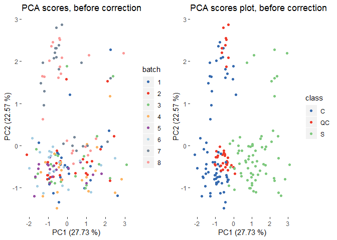

Left side plot above clearly shows that samples measured in batches 7 and 8 are differentiating from bathes 1 to 6. On the right hand side plot the seperation between samples classes is still visible, but also seperation between measurement batches is clearly visible across PC2 axis.

### Correlation between signal intensity and measurment order of QC samples

Alternatively, trends in measured signal related to measurement order could indicate if signal and/or batch correction is required. The plot below illustrates the measured signal of QC samples across all 8 batches. To be able to compare all 20 features measured at different signal ranges, the data will be scaled to unit variance (UV).

``` r
# autoscale the QC data
QCdata <- data[QChits,]
QCdata2 <- as.data.frame(scale(QCdata, scale=T, center=T))

# prepare the data for plotting
plotdata <- melt(QCdata2, value.name="intensity")
plotdata$index <- rep(1:nrow(QCdata2), ncol(QCdata2))

plotdata$batch <- as.factor(batch[QChits])

# plot
ggplot(data=plotdata, aes(x=index, y=intensity, col=batch))+ geom_point()+ facet_wrap(~ variable, ncol=4)+
   theme(panel.background=element_blank())+ scale_color_manual(values=manual_color)
```

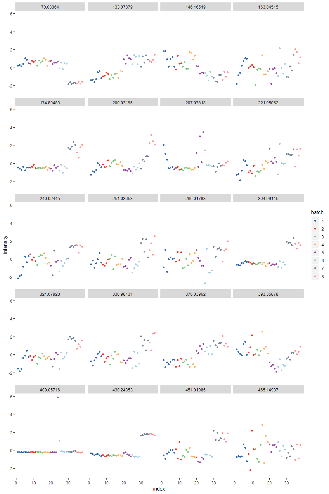

This figure indicates that there is some fluctuation in the measured signal across the eight batches, and that some features are following a similar pattern , i.e. they are correlated. We can create a similar plot to the one above including linear regression fit between measured data points.

``` r
ggplot(data=plotdata, aes(x=index, y=intensity, col=batch))+ geom_point()+ facet_wrap(~ variable, ncol=4)+
  geom_smooth(method="lm", se=TRUE, colour="black")+
  theme(panel.background=element_blank())+ scale_color_manual(values=manual_color)
```

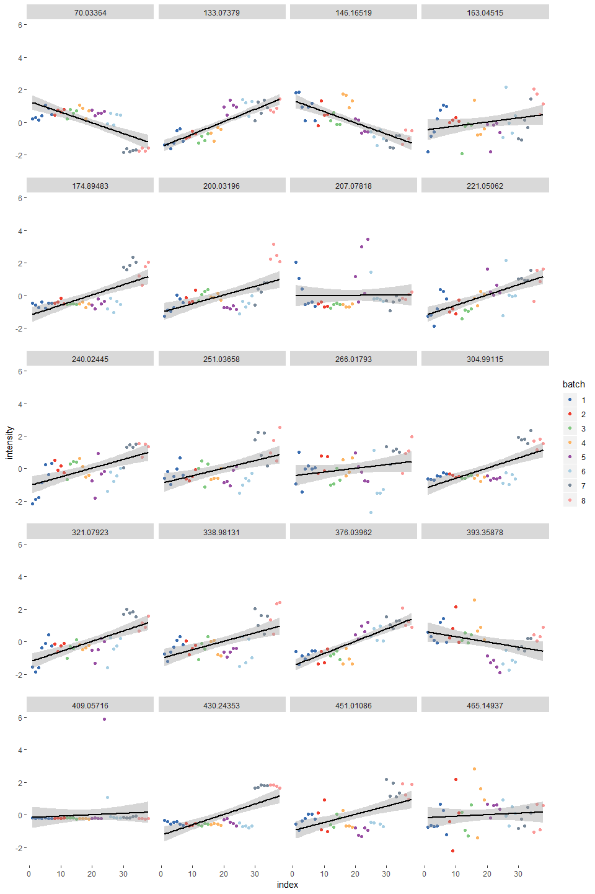

The plot above indicates that some trends can be observed. It is possible to calculate actual correlation values within QC samples for each measured feature, and we will use Kendall's *tau* statistic to estimate a rank-based measure of association.

``` r
sampleorder <- c(1:nrow(QCdata))

correlations <- matrix(ncol=2, nrow=ncol(data))
rownames(correlations) <- colnames(data)
colnames(correlations) <- c("tau","p.value")
correlations <- as.data.frame(correlations)

for (coln in 1:ncol(data)) {
  stat <- cor.test(sampleorder, QCdata[, coln], method="kendall")
  correlations$tau[coln] <- stat$estimate
  correlations$p.value[coln] <- stat$p.value
}

correlations
```

    ##                   tau      p.value
    ## 70.03364  -0.39118065 4.243865e-04
    ## 133.07379  0.62162162 2.908914e-09
    ## 146.16519 -0.56472262 1.190541e-07
    ## 163.04515  0.10953058 3.417433e-01
    ## 174.89483  0.35419630 1.515758e-03
    ## 200.03196  0.35704125 1.381142e-03
    ## 207.07818  0.18065434 1.135934e-01
    ## 221.05062  0.48506401 8.425472e-06
    ## 240.02445  0.39118065 4.243865e-04
    ## 251.03658  0.26600284 1.863325e-02
    ## 266.01793  0.18065434 1.135934e-01
    ## 304.99115  0.28591750 1.123389e-02
    ## 321.07923  0.43669986 7.237859e-05
    ## 338.98131  0.32290185 4.004242e-03
    ## 376.03962  0.59601707 1.672311e-08
    ## 393.35878 -0.19203414 9.217241e-02
    ## 409.05716  0.14935989 1.924150e-01
    ## 430.24353  0.21763869 5.561224e-02
    ## 451.01086  0.24624625 3.233060e-02
    ## 465.14937  0.04694168 6.894542e-01

While most of the calculated *tau* values and corresponding *p-values* indicate that there is not a strong trend between measurement order and the measured QC sample signal, some of the values don't match the trends we can observe in figure above. For features "133.07379" and "376.03962" calculated correlation values are aroun 0.6 and in figure above intensity increasing tren can be observed. For other features correlation values are relatively low, but in figure above clear trends in signal changes in batches 7 and 8 can be osberved.

Alternatively it is possible to calculate correlation statistics per batch and visualise the results.

``` r
correlations <- matrix(ncol=8, nrow=ncol(data))
rownames(correlations) <- colnames(data)
colnames(correlations) <- unique(batch)

QCbatch <- batch[QChits]

for (coln in 1:ncol(data)) {
  for (bch in 1:8) {
    sampleorder <- scale(c(1:length(which(QCbatch==bch))), center=T, scale=T)
    
    if ((length(sampleorder) - length(which(is.na(QCdata[which(QCbatch==bch), coln])))) >= 3){
      correlations[coln,bch] <- cor.test(sampleorder, QCdata[which(QCbatch==bch), coln], method="kendall")$estimate
    }
  }
}

round(correlations, 2)
```

    ##               1     2     3     4    5    6    7     8
    ## 70.03364   0.52  0.67  0.33 -0.67  0.0  0.0  0.4  0.67
    ## 133.07379  0.62  0.67  0.67  0.33  0.0  0.2  0.4  0.67
    ## 146.16519 -0.43  0.33 -0.33 -0.67 -0.6 -0.2  0.4  0.33
    ## 163.04515  0.90  0.33  0.67  0.00  0.0  0.2  0.6 -0.67
    ## 174.89483  0.14  0.00  0.00  0.00  0.4  0.0  0.6  0.67
    ## 200.03196  0.62  0.33  1.00 -0.33 -0.2  0.6  0.8 -0.33
    ## 207.07818 -0.71 -0.33  0.33  0.00  0.4 -0.8  0.4  0.67
    ## 221.05062  0.52  0.33  0.67  0.33 -0.4  0.0  0.0  0.67
    ## 240.02445  0.90 -0.67  0.67 -0.67  0.4  0.6  0.8 -0.33
    ## 251.03658  0.43  0.67  0.00  0.67  0.6  0.8 -0.4  0.33
    ## 266.01793  0.14  0.33  0.67  0.33 -1.0  0.4 -0.2  1.00
    ## 304.99115  0.52 -0.67  1.00  0.00  0.0  0.0  0.0  0.00
    ## 321.07923  0.62  0.33  0.67  0.00  0.6  0.4 -0.2  0.67
    ## 338.98131  0.71  0.00  0.67 -0.67  0.4  0.2 -0.4  0.67
    ## 376.03962  0.43  0.67  0.00  0.00  0.6 -0.2  0.0 -0.67
    ## 393.35878 -0.05  0.00  0.00 -0.67 -0.8  0.0  0.4  0.33
    ## 409.05716 -0.52  0.67 -0.67 -1.00  0.4 -1.0  0.4 -0.33
    ## 430.24353 -0.52  0.00  0.33 -0.33 -0.8 -0.4  0.4 -0.67
    ## 451.01086  0.62 -0.33  0.33 -1.00 -0.2 -1.0 -0.4 -0.33
    ## 465.14937  0.14  0.33  0.00 -0.33 -0.2 -0.2  0.6  0.33

``` r
plotdata <- as.data.frame(correlations)
plotdata$feature <- rownames(plotdata)

plotdata <- melt(plotdata, variable.name="batch")
```

    ## Using feature as id variables

``` r
plotdata$feature <- factor(plotdata$feature, ordered=T, levels=unique(plotdata$feature))

ggplot(data=plotdata, aes(x=batch, y=feature, fill=value))+ 
  geom_tile()+ scale_fill_gradient2()
```

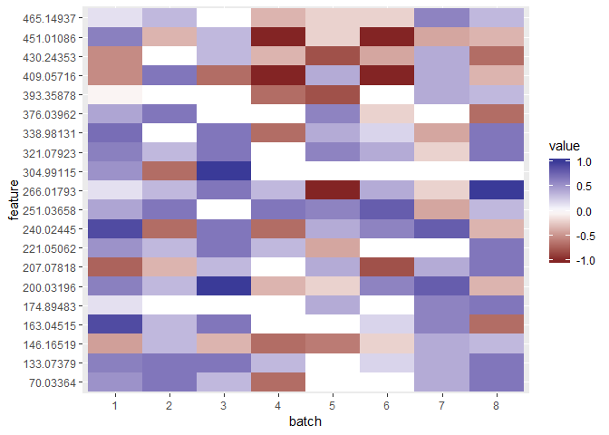

Figure above indicates that there are significant acquisition order related trends within some batches. Fore example, bathes 4 and 6 for features '451.01081' and '409.05716'.

### Using univariate regression to estimate signal trends and variability within QC sample

It is possible to apply univariate regression to the QC sample measurement order and signal intensity, to estimate correlation and spread (R2) of the measured data points.

``` r
sampleorder <- c(1:nrow(QCdata))

regressionout <- matrix(ncol=3, nrow=ncol(data))
rownames(regressionout) <- colnames(data)
colnames(regressionout) <- c("R2.adj","coefficient","p.value")
regressionout <- as.data.frame(regressionout)

for (coln in 1:ncol(data)) {
  tempdat <- data.frame(x=sampleorder, y=QCdata[,coln])
  stat <- lm(x ~ y, data=tempdat)
  stat <- summary(stat)
  
  regressionout$R2.adj[coln] <- stat$adj.r.squared  
  regressionout$coefficient[coln] <- stat$coefficients[2,1]
  regressionout$p.value[coln] <- stat$coefficients[2,4]
}

regressionout
```

    ##                R2.adj   coefficient      p.value
    ## 70.03364   0.51755345 -6.974939e-04 2.171124e-07
    ## 133.07379  0.71719172  1.679293e-04 1.256275e-11
    ## 146.16519  0.57693876 -5.866596e-04 1.946902e-08
    ## 163.04515  0.05007205  1.684384e-04 9.445244e-02
    ## 174.89483  0.47156655  1.185480e-03 1.163525e-06
    ## 200.03196  0.33228648  1.071348e-03 9.073995e-05
    ## 207.07818 -0.02752121  3.324954e-06 9.249914e-01
    ## 221.05062  0.47782665  6.996785e-04 9.336168e-07
    ## 240.02445  0.33644972  9.756783e-04 8.067073e-05
    ## 251.03658  0.24756124  9.028676e-04 8.748657e-04
    ## 266.01793  0.03893146  8.832713e-04 1.226793e-01
    ## 304.99115  0.46249993  2.492342e-04 1.593517e-06
    ## 321.07923  0.48054403  5.318280e-04 8.478678e-07
    ## 338.98131  0.31485610  2.306224e-03 1.474563e-04
    ## 376.03962  0.69755324  1.741943e-03 4.258938e-11
    ## 393.35878  0.10180922 -1.517244e-04 2.869818e-02
    ## 409.05716 -0.01861817  2.395911e-06 5.729142e-01
    ## 430.24353  0.48561786  2.260156e-04 7.073656e-07
    ## 451.01086  0.29461592  2.231798e-03 3.081623e-04
    ## 465.14937 -0.01675834  2.478707e-04 5.361537e-01

And regression statistics per batch.

``` r
regPerBatch <- matrix(ncol=8, nrow=ncol(data))
rownames(regPerBatch) <- colnames(data)
colnames(regPerBatch) <- unique(batch)

QCbatch <- batch[QChits]

for (coln in 1:ncol(data)) {
  for (bch in 1:8) {
    sampleorder <- c(1:length(which(QCbatch==bch)))
    
    tempdat <- data.frame(x=sampleorder, y=QCdata[which(QCbatch==bch),coln])
    stat <- lm(x ~ y, data=tempdat)
    stat <- summary(stat)
    
    regPerBatch[coln,bch] <- stat$adj.r.squared
  }
}

round(regPerBatch,2)
```

    ##               1     2     3     4     5     6     7     8
    ## 70.03364   0.33  0.34  0.12  0.03 -0.33 -0.04 -0.22 -0.05
    ## 133.07379  0.24  0.46  0.32 -0.07 -0.23 -0.24  0.06  0.50
    ## 146.16519  0.39 -0.40 -0.06  0.18  0.62 -0.28  0.10  0.04
    ## 163.04515  0.92 -0.29  0.47  0.18 -0.30 -0.33  0.68  0.31
    ## 174.89483 -0.19 -0.49 -0.50 -0.38  0.05 -0.31  0.39  0.34
    ## 200.03196  0.61 -0.06  0.89 -0.43 -0.26  0.54  0.70 -0.33
    ## 207.07818  0.76  0.09  0.23 -0.45 -0.03  0.43 -0.01  0.65
    ## 221.05062  0.49  0.15  0.48 -0.09  0.15 -0.33  0.11  0.32
    ## 240.02445  0.85  0.41  0.54  0.75 -0.11  0.39  0.44 -0.50
    ## 251.03658  0.08  0.59 -0.47  0.55  0.55  0.84  0.08 -0.13
    ## 266.01793 -0.14 -0.12 -0.12 -0.48  0.89 -0.33 -0.32  0.90
    ## 304.99115  0.70  0.45  0.85 -0.47 -0.23 -0.27 -0.21 -0.49
    ## 321.07923  0.70 -0.41  0.73 -0.49  0.31  0.24 -0.13  0.50
    ## 338.98131  0.58 -0.46  0.56  0.70  0.29 -0.30 -0.15  0.27
    ## 376.03962  0.05 -0.03 -0.35 -0.45  0.41 -0.29 -0.32  0.47
    ## 393.35878 -0.16 -0.49 -0.44  0.63  0.81 -0.30  0.46  0.07
    ## 409.05716  0.29  0.22  0.62  0.89  0.33  0.40  0.03 -0.43
    ## 430.24353  0.47 -0.50 -0.07 -0.18  0.84  0.29  0.63  0.70
    ## 451.01086  0.46 -0.42  0.23  0.46 -0.32  0.89  0.08 -0.48
    ## 465.14937 -0.15 -0.22 -0.47 -0.44 -0.32 -0.22  0.46 -0.17

``` r
plotdata <- as.data.frame(regPerBatch)
plotdata$feature <- rownames(plotdata)

plotdata <- melt(plotdata, variable.name="batch")
```

    ## Using feature as id variables

``` r
plotdata$feature <- factor(plotdata$feature, ordered=T, levels=unique(plotdata$feature))

ggplot(data=plotdata, aes(x=batch, y=feature, fill=value))+ 
  geom_tile() + scale_fill_gradient2()
```

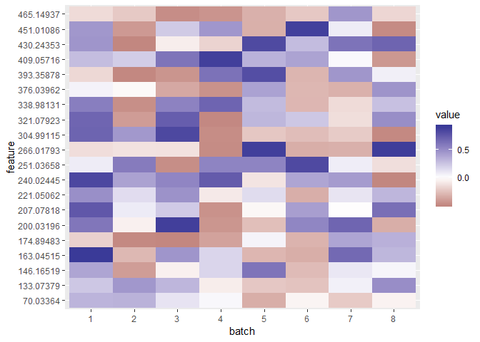

### Example of signal and batch correction for a single feature

Let's have a closer look to '451.01086' measured feature and how signal correction can be applied.

``` r
data <- data.frame(data=sbcdata$data$`451.01086`, batch=batch, class=factor(class, ordered=TRUE))
data$order <- c(1:nrow(data))
data$batch <- as.factor(data$batch)

ggplot(data=data, aes(x=order, y=log(data,10), col=batch, shape=class)) + geom_point()+
  theme(panel.background=element_blank())+ scale_color_manual(values=manual_color)
```

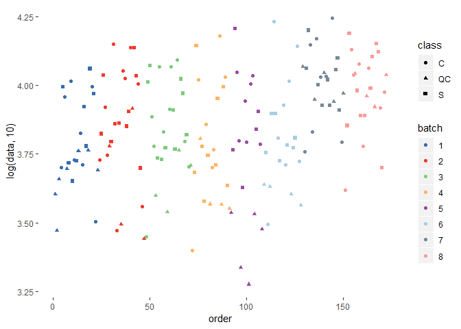

In this plot circles and squares represent biological samples and triangles are the QC samples. Analytical batches are represented by colours. Differences in measured intensities can be observed between analytical batches.

Similar plot for QC samples only

``` r
QCdata <- data[data$class=="QC",]

ggplot(data=QCdata, aes(x=order, y=log(data,10), col=batch, shape=class))+ geom_point()+
  theme(panel.background=element_blank())+ scale_color_manual(values=manual_color, drop=FALSE)+
  scale_shape_manual(values=c(16, 17, 15), drop=FALSE)
```

    ## Warning: Removed 1 rows containing missing values (geom_point).

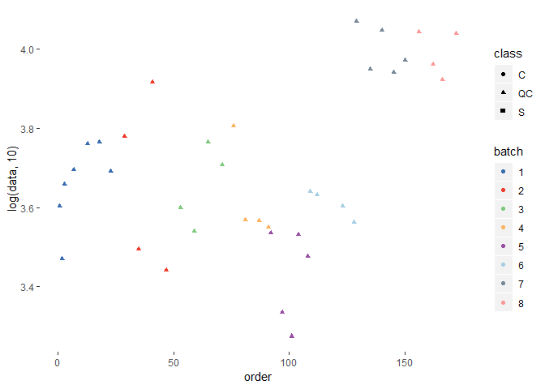

This figure indicates that there is signal drift present within each analytical batch and between analytical batches for this feature. Let's have a look at the RSD% for all QC samples and QC samples within each analytical batch.

``` r
FUN <- function(x) sd(x, na.rm=T)/mean(x, na.rm=T) * 100

# RSD% of biological and QC samples within all 6 batches:
out <- c(NA,NA)
names(out) <- c("Biological","QC")
out[1] <-FUN(data$data[-QChits])
out[2] <-FUN(data$data[QChits])
out
```

    ## Biological         QC 
    ##   39.76459   49.97187

``` r
# RSD% per batch:
out <- matrix(ncol=8,nrow=2)
colnames(out) <- c(1:8)
rownames(out) <- c("Biological","QC")
for (i in 1:8) {
  
  out[1, i] <- FUN(data$data[which(!class=="QC" & batch==i)])
  out[2, i] <- FUN(data$data[which(class=="QC" & batch==i)])
}

out
```

    ##                   1        2        3        4        5         6        7
    ## Biological 35.55823 39.56935 34.76017 49.61587 38.86485 47.646959 31.45103
    ## QC         21.27721 51.25584 23.32173 31.68287 25.70845  7.814082 13.79785
    ##                   8
    ## Biological 32.97728
    ## QC         13.49659

From the outputs above it's clear that variance of measured QC sample intensities between batches is high (RSD% = 50), and is relatively high within batches 1 to 5. For batch 3 QC variation exceeds that of the biological samples.

Signal/batch correction using smoothed spline fitting
=====================================================

We will apply QC-RSC signal correction method as it is described in Kirwan et al (<https://dx.doi.org/10.1007/s00216-013-6856-7>).

The first step involves extracting QC sample data

``` r
qcData <- data$data[class == "QC"]
qc_batch <- batch[class == "QC"]
qc_order <- order[class == "QC"]

qcData
```

    ##  [1]  4005.083  2955.796  4552.907  4958.136  5760.821  5812.888  4900.625
    ##  [8]  6010.015  3120.287  8224.495  2765.307  3964.597  3459.146  5813.192
    ## [15]  5104.457  6388.102  3694.081  3691.042  3553.922  3431.332  2165.299
    ## [22]  1883.597  3399.188  2998.507  4360.648  4282.248        NA  4016.637
    ## [29]  3654.521 11715.840  8870.079 11131.250  8710.432  9369.025 11047.540
    ## [36]  9127.718  8363.207 10924.000

Note that the QC data has 1 missing value. Smoothed spline regression doesn't support missing values, so the workaround is to apply missing value imputation or remove the NA values from input to the smoothed spline fit function (which we will do here). We recommend at least 4 QC values be present per batch for the fit to be reliable.

The next step involves applying the smoothed spline fit function to the QC sample data within each batch. We will look at the data for batch 6 in detail.

``` r
nbatch <- unique(qc_batch)

nb <- 6

# Sample measurement order
x <- qc_order[qc_batch==nbatch[nb]]

# Measured peak intensity or area
y <- qcData[qc_batch==nbatch[nb]]
y
```

    ## [1] 4360.648 4282.248       NA 4016.637 3654.521

In this example, signal for 1 QC sample wasn't measured, so these samples need to be removed. The smoothed spline regression input will look like this:

``` r
NAhits <- which(is.na(y))
if (length(NAhits)>0) {
  x <- x[-c(NAhits)]
  y <- y[-c(NAhits)]
  rbind(x,y)
}
```

    ##       [,1]     [,2]     [,3]     [,4]
    ## x  109.000  112.000  123.000  128.000
    ## y 4360.648 4282.248 4016.637 3654.521

We will apply a log transformation to the data before fitting

``` r
y <- log((y + sqrt(y^2)) / 2)
y
```

    ## [1] 8.380376 8.362233 8.298200 8.203720

Fit a smoothed cubic spline using internal cross-validation for parameter estimation

``` r
sp.obj <- smooth.spline(x, y, cv=TRUE) 
sp.obj
```

    ## Call:
    ## smooth.spline(x = x, y = y, cv = TRUE)
    ## 
    ## Smoothing Parameter  spar= 0.3748593  lambda= 0.001544601 (15 iterations)
    ## Equivalent Degrees of Freedom (Df): 3.34102
    ## Penalized Criterion (RSS): 7.185226e-05
    ## PRESS(l.o.o. CV): 0.001528177

``` r
out <- rbind(y,sp.obj$y)
row.names(out) <- c("measured","fitted")
out
```

    ##              [,1]     [,2]     [,3]     [,4]
    ## measured 8.380376 8.362233 8.298200 8.203720
    ## fitted   8.379251 8.365584 8.291754 8.207941

Now the smoothed spline fit is used to predict values for the biological sample for the current batch.

``` r
valuePredict=predict(sp.obj, order[batch==nb])

plotchr <- as.numeric(data$class)

# reverse the log transformation to convert the predictions back to the original scale
valuePredict$y <- exp(valuePredict$y)

plotdata <- data.frame(measured=data$data[batch==nb], fitted=valuePredict$y , Class=class[batch==nb], order=order[batch==nb])
plotdata2 <- melt(plotdata, id.vars=c("Class","order"), value.name="intensity", variable.name="data")

ggplot(data=plotdata2, aes(x=order, y=log(intensity,10), color=data, shape=Class))+ geom_point()+
  theme(panel.background=element_blank())+ scale_color_manual(values=manual_color)+
  scale_shape_manual(values=c(16, 17, 15), drop=FALSE)
```

    ## Warning: Removed 1 rows containing missing values (geom_point).

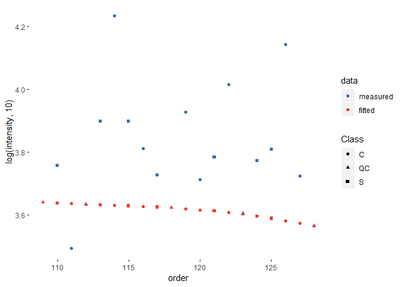

The figure above shows the original data points in blue and the fitted data in red. Triangles represent QC samples.

The next step in signal correction is to "flatten" the fitted curve to correct for signal drift. This can usually be done by subtracting the fitted values from the actual measured values for each feature. To avoid getting negative values we will add the median value of the feature to the corrected data.

``` r
fitmedian <- median(plotdata$measured, na.rm=T)
plotdata$corrected_subt <- (plotdata$measured - plotdata$fitted) + fitmedian

plotdata2 <- melt(plotdata, id.vars=c("Class","order"), value.name="intensity", variable.name="data")

plotdata_class <- as.character(plotdata2$Class)
plotdata_class[plotdata_class == "S"] <- "Sample"
plotdata_class[plotdata_class == "C"] <- "Sample"
plotdata2$Class <- factor(plotdata_class)

ggplot(data=plotdata2, aes(x=order, y=intensity, color=data, shape=Class)) + geom_point()+
  theme(panel.background=element_blank())+ scale_color_manual(values=manual_color)+
  facet_grid(Class ~ .)+
  scale_shape_manual(values=c(17, 16), drop=FALSE)
```

    ## Warning: Removed 2 rows containing missing values (geom_point).

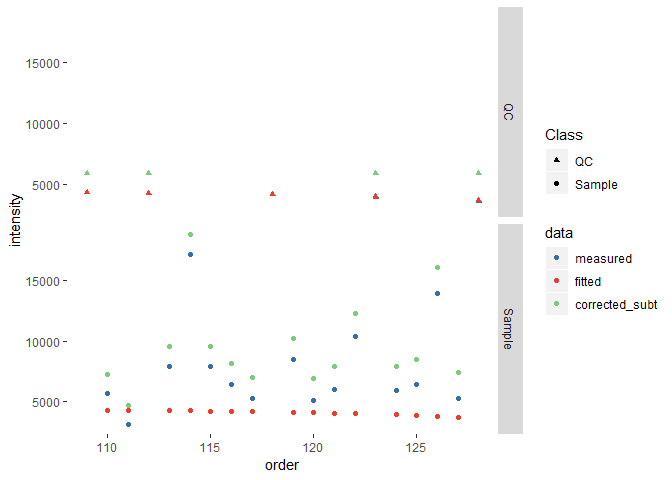

An alternative to subtraction of the fitted values is to divide them by the median of the fit and use the resulting coefficients to correct the data points. The same general relative trends should be observed in either case.

``` r
plotdata$corrected_div <- plotdata$measured/(plotdata$fitted/fitmedian)

plotdata3 <- plotdata[,c("Class", "order", "corrected_subt", "corrected_div")]

plotdata3 <- melt(plotdata3, id.vars=c("Class","order"), value.name="intensity", variable.name="data")

plotdata_class <- as.character(plotdata3$Class)
plotdata_class[plotdata_class=="S"] <- "Sample"
plotdata_class[plotdata_class=="C"] <- "Sample"
plotdata3$Class <- factor(plotdata_class)

ggplot(data=plotdata3, aes(x=order, y=intensity, color=data, shape=Class))+ geom_point()+
  theme(panel.background=element_blank())+ scale_color_manual(values=manual_color)+
  geom_smooth(se=F)+ facet_grid(Class ~ .)
```

    ## `geom_smooth()` using method = 'loess' and formula 'y ~ x'

    ## Warning: Removed 2 rows containing non-finite values (stat_smooth).

    ## Warning in simpleLoess(y, x, w, span, degree = degree, parametric =
    ## parametric, : span too small. fewer data values than degrees of freedom.

    ## Warning in simpleLoess(y, x, w, span, degree = degree, parametric =
    ## parametric, : pseudoinverse used at 108.91

    ## Warning in simpleLoess(y, x, w, span, degree = degree, parametric =
    ## parametric, : neighborhood radius 14.095

    ## Warning in simpleLoess(y, x, w, span, degree = degree, parametric =
    ## parametric, : reciprocal condition number 0

    ## Warning in simpleLoess(y, x, w, span, degree = degree, parametric =
    ## parametric, : There are other near singularities as well. 259.05

    ## Warning in sqrt(sum.squares/one.delta): NaNs produced

    ## Warning in simpleLoess(y, x, w, span, degree = degree, parametric =
    ## parametric, : span too small. fewer data values than degrees of freedom.

    ## Warning in simpleLoess(y, x, w, span, degree = degree, parametric =
    ## parametric, : pseudoinverse used at 108.91

    ## Warning in simpleLoess(y, x, w, span, degree = degree, parametric =
    ## parametric, : neighborhood radius 14.095

    ## Warning in simpleLoess(y, x, w, span, degree = degree, parametric =
    ## parametric, : reciprocal condition number 0

    ## Warning in simpleLoess(y, x, w, span, degree = degree, parametric =
    ## parametric, : There are other near singularities as well. 259.05

    ## Warning in sqrt(sum.squares/one.delta): NaNs produced

    ## Warning: Removed 2 rows containing missing values (geom_point).

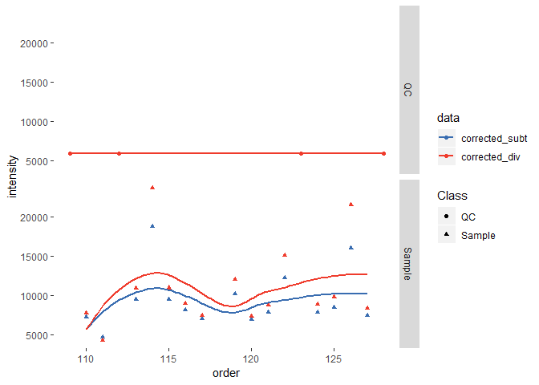

So far we have applied signal correction for data points within one analytical batch. The code below will perform the same steps for each of the 8 batches.

``` r
outl <- rep(NA, nrow(data))

for (nb in 1:length(nbatch)){
  # assigning sample injection order for a batch to 'x', and corresponding intensities to 'y'
  x <- qc_order[qc_batch == nbatch[nb]]
  y <- qcData[qc_batch == nbatch[nb]]
  
  # remove measurements with missing values
  NAhits <- which(is.na(y))
  if (length(NAhits) > 0) {
      x <- x[-c(NAhits)]
      y <- y[-c(NAhits)]
  }
      
  # require at least 4 data points for QC fit
  if (length(y) >= 4) {
    range <- c(batch == nbatch[nb])
      
    # Order is a vector of sample indices for the current batch
    outl[range] <- sbcms::splineSmoother(x=x, y=y, newX=order[range], log=TRUE, a=1, spar=0)
  
    # If less than 5 data points are present, return empty values   
  } else {
      range <- c(batch == nbatch[nb])
      outl[range] <- rep(NA, nrow(data))[range]
  }
}

plotdata <- data.frame(measured=data$data, fitted=outl, Class=class, batch=batch, order=c(1:nrow(data)))
plotdata2 <- melt(plotdata, id.vars=c("batch","Class","order"), value.name="intensity", variable.name="data")

ggplot(data=plotdata2, aes(x=order, y=log(intensity,10), color=data, shape=Class)) + geom_point(alpha=0.5)+
  theme(panel.background=element_blank()) + scale_color_manual(values=manual_color)
```

    ## Warning: Removed 1 rows containing missing values (geom_point).

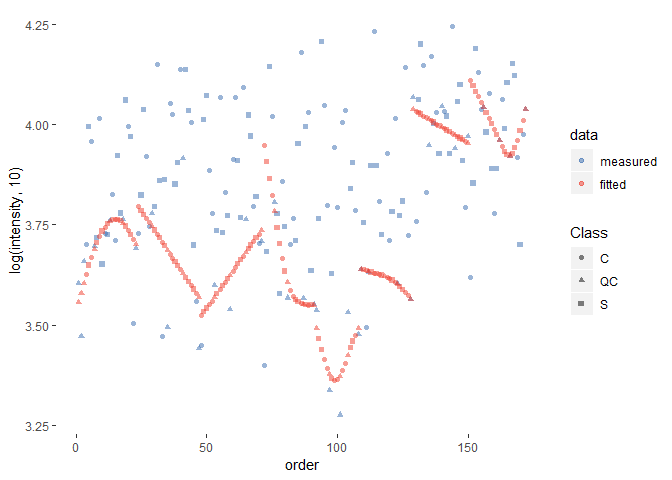

After smoothed spline fit per each batch is calculated, we can apply signal correction within each batch.

``` r
# median intensity value is used to adjust batch effect

mpa <- rep(NA, nrow(data))

for (bch in 1:8) {
  mpa[batch==bch] <- median(data$data[batch==bch], na.rm=T)
}


QC_fit <- outl/mpa

# and correct actual data
res <- data$data/QC_fit

# correct data using subtratcion
res2 <- (data$data -outl)+mpa

plotdata <- data.frame(measured=data$data, corrected_subt=res2, corrected_div=res, Class=class, batch=batch,
  order=c(1:nrow(data)))
plotdata2 <- melt(plotdata, id.vars=c("batch","Class","order"), value.name="intensity", variable.name="data")

ggplot(data=plotdata2, aes(x=order, y=log(intensity,10), color=data, shape=Class)) + geom_point(alpha=0.2)+
  theme(panel.background=element_blank()) + scale_color_manual(values=manual_color) +
  geom_smooth(se=F)+
  facet_grid(Class ~ .)
```

    ## Warning in FUN(X[[i]], ...): NaNs produced

    ## Warning in FUN(X[[i]], ...): NaNs produced

    ## Warning in FUN(X[[i]], ...): NaNs produced

    ## `geom_smooth()` using method = 'loess' and formula 'y ~ x'

    ## Warning: Removed 4 rows containing non-finite values (stat_smooth).

    ## Warning: Removed 4 rows containing missing values (geom_point).

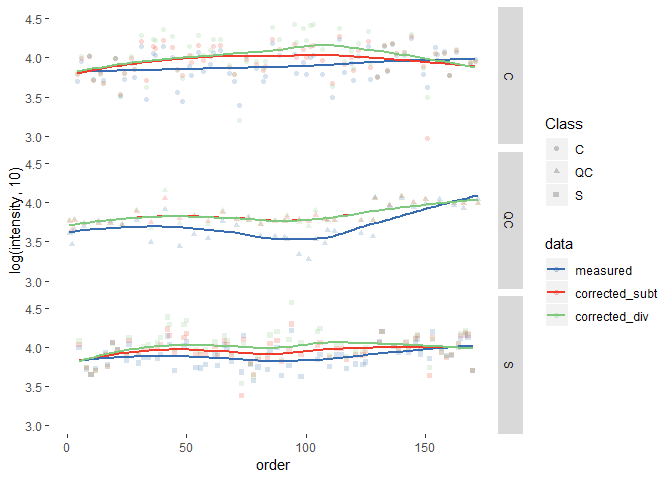

The figure above shows the measured data points in blue and the corrected values using subtraction (red) or division(green). Fitted smoothed spline curves of the corrected data over all batches still indicates that there is batch related signal drift in the data. This can be corrected using the "grand median".

First, a grand median is calculated across all batches, and then difference between each batch median and the grand median is subtracted from all the samples in that batch, to remove the difference.

``` r
mpa <- rep(NA, nrow(data))

for (bch in 1:8) {
  
  mpa[batch == bch] <- median(res2[batch == bch], na.rm=T)
}

grandMedian <- median(res2, na.rm=T)

mpa <- mpa - grandMedian

plotdata$corrected_subt <- plotdata$corrected_subt - mpa

mpa <- rep(NA, nrow(data))

for (bch in 1:8) {
  
  mpa[batch == bch] <- median(res[batch == bch], na.rm=T)
}

grandMedian <- median(res, na.rm=T)

mpa <- mpa - grandMedian

plotdata$corrected_div <- plotdata$corrected_div - mpa

plotdata2 <- melt(plotdata, id.vars=c("batch","Class","order"), value.name="intensity", variable.name="data")

ggplot(data=plotdata2, aes(x=order, y=log(intensity,10), color=data, shape=Class)) + geom_point(alpha=0.2)+
  theme(panel.background=element_blank())+ scale_color_manual(values=manual_color)+
  geom_smooth(se=F)+
  facet_grid(Class ~ .)
```

    ## Warning in FUN(X[[i]], ...): NaNs produced

    ## Warning in FUN(X[[i]], ...): NaNs produced

    ## Warning in FUN(X[[i]], ...): NaNs produced

    ## `geom_smooth()` using method = 'loess' and formula 'y ~ x'

    ## Warning: Removed 6 rows containing non-finite values (stat_smooth).

    ## Warning: Removed 6 rows containing missing values (geom_point).

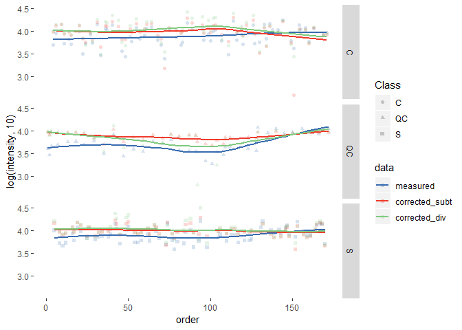

We can calculate RSD% before and after correction.

``` r
FUN <- function(x) sd(x, na.rm=T)/mean(x, na.rm=T) * 100

# RSD% of biological and QC samples within all 6 batches:
out <- matrix(nrow=2, ncol=2)
colnames(out) <- c("Biological","QC")
rownames(out) <- c("measured", "corrected")
out[1,1] <-FUN(data$data[-QChits])
out[1,2] <-FUN(data$data[QChits])
out[2,1] <-FUN(res[-QChits])
out[2,2] <-FUN(res[QChits])

round(out, 2)
```

    ##           Biological    QC
    ## measured       39.76 49.97
    ## corrected      50.21 33.19

``` r
# RSD% per batch:
out <- matrix(ncol=8,nrow=4)
colnames(out) <- c(1:8)
rownames(out) <- c("Biological","QC","Corrected biological","Corrected QC")
for(i in 1:8) {
  out[1, i] <- FUN(data$data[which(!class=="QC" & batch==i)])
  out[2, i] <- FUN(data$data[which(class=="QC" & batch==i)])
  out[3, i] <- FUN(res[which(!class=="QC" & batch==i)])
  out[4, i] <- FUN(res[which(class=="QC" & batch==i)])
}

round(out, 2)
```

    ##                          1     2     3     4     5     6     7     8
    ## Biological           35.56 39.57 34.76 49.62 38.86 47.65 31.45 32.98
    ## QC                   21.28 51.26 23.32 31.68 25.71  7.81 13.80 13.50
    ## Corrected biological 37.82 45.26 38.67 59.79 38.23 47.99 31.22 37.15
    ## Corrected QC         11.54 53.40 16.76  6.17 18.34  0.49 11.02  0.00

The data has now been corrected for batch and signal drift effects.

All the steps from example above can be applied to all or susbet of features in the data set using 'sbcms' function "QCRSC".

We can calculate RSD% statistics per batch before and after correction and visualise the results with a box plot.

``` r
RSDQC <- matrix(ncol=8, nrow=ncol(data))
RSDsample <- matrix(ncol=8, nrow=ncol(data))
colnames(RSDQC) <- unique(batch)
colnames(RSDsample) <- unique(batch)

RSDQC_corrected <- matrix(ncol=8, nrow=ncol(data))
RSDsample_corrected <- matrix(ncol=8, nrow=ncol(data))
colnames(RSDQC_corrected) <- unique(batch)
colnames(RSDsample_corrected) <- unique(batch)

rownames(RSDQC) <- colnames(data)
rownames(RSDsample) <- colnames(data)
rownames(RSDQC_corrected) <- colnames(data)
rownames(RSDsample_corrected) <- colnames(data)

# for each feature
for (i in 1:ncol(data)) {
  # for each batch
  for (nb in 1:8) {
    RSDQC[i, nb] <- FUN(data[which(class == "QC" & batch == nb), i]) # RSD% of QCs in this batch
    RSDsample[i, nb] <- FUN(data[which(!class == "QC" & batch == nb), i]) # RSD% of samples in this batch
    RSDQC_corrected[i, nb] <- FUN(corrected_data[which(class == "QC" & batch == nb), i]) # RSD% of QCs in this batch after correction
    RSDsample_corrected[i, nb] <- FUN(corrected_data[which(!class == "QC" & batch == nb), i]) # RSD% of samples in this batch after correction
  }
}

# prepare results for plotting
plotdataQC <- melt(as.data.frame(RSDQC), variable.name="batch", value.name="RSD")
```

    ## No id variables; using all as measure variables

``` r
plotdataQC$Class <- "QC"

plotdataBio <- melt(as.data.frame(RSDsample), variable.name="batch", value.name="RSD")
```

    ## No id variables; using all as measure variables

``` r
plotdataBio$Class <- "Sample"

plotdataQC_corrected <- melt(as.data.frame(RSDQC_corrected), variable.name="batch", value.name="RSD")
```

    ## No id variables; using all as measure variables

``` r
plotdataQC_corrected$Class <- "QC_corr"

plotdataBio_corrected <- melt(as.data.frame(RSDsample_corrected), variable.name="batch", value.name="RSD")
```

    ## No id variables; using all as measure variables

``` r
plotdataBio_corrected$Class <- "Sample_corr"

plotdata <- rbind(plotdataQC, plotdataQC_corrected)

plotdata$Class <- as.factor(plotdata$Class)

# plot
ggplot(data=plotdata, aes(x=Class, y=RSD, fill=Class)) + geom_boxplot()+
  facet_wrap(~ batch, ncol=3)+
  ylab("RSD%")+
  theme(panel.background=element_blank())+
  scale_y_continuous(limits=c(0, 50))
```

    ## Warning: Removed 4 rows containing non-finite values (stat_boxplot).

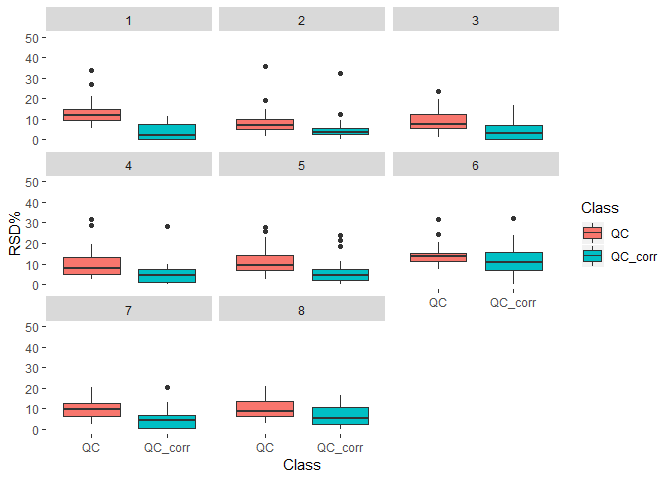

``` r
plotdata <- rbind(plotdataBio, plotdataBio_corrected)

plotdata$Class <- as.factor(plotdata$Class)

# plot
ggplot(data=plotdata, aes(x=Class, y=RSD, fill=Class)) + geom_boxplot()+
  facet_wrap(~ batch, ncol=3)+
  ylab("RSD%")+
  theme(panel.background=element_blank())
```

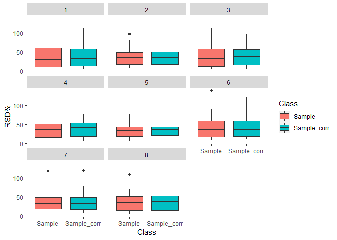

Or compare the scores plots of princiapl components analysis before and after correction.

``` r
# PQN used to normalise data
# KNN for missing value imputation
# glog scaling method 
# A more detailed overview is detailed in Di Guida et al, Metabolomics, 12:93, 2016
# https://dx.doi.org/10.1007/s11306-016-1030-9

pca_data <- pmp::pqn_normalisation(data, classes=class, qc_label="QC")[[1]]
pca_data <- pmp::mv_imputation(pca_data, method="KNN", k=5, rowmax=0.5, colmax=0.5, maxp=NULL, check_df=F)
pca_data <- pmp::glog_transformation(pca_data, classes=class, qc_label="QC")

pca_corrected_data <- pmp::pqn_normalisation(corrected_data, classes=class, qc_label="QC")[[1]]
pca_corrected_data <- pmp::mv_imputation(pca_corrected_data, method="KNN", k=5, rowmax=0.5, colmax=0.5, maxp=NULL, check_df=F)
pca_corrected_data <- pmp::glog_transformation(pca_corrected_data, classes=class, qc_label="QC")

pca_data <- prcomp(t(pca_data), center=T, scale=F)
pca_corrected_data <- prcomp(t(pca_corrected_data), center=T, scale=F)

# Calculate percentage of explained variance of the first two PC's
exp_var_pca <- round(((pca_data$sdev^2)/sum(pca_data$sdev^2)*100)[1:2],2)
exp_var_pca_corrected <- round(((pca_corrected_data$sdev^2)/sum(pca_corrected_data$sdev^2)*100)[1:2],2)

plots <- list()

plotdata <- data.frame(PC1=pca_data$x[, 1], PC2=pca_data$x[, 2], batch=as.factor(batch),
                       class=class)

plots[[1]] <- ggplot(data=plotdata, aes(x=PC1, y=PC2, col=batch))+ geom_point()+
  theme(panel.background=element_blank())+
  scale_color_manual(values=manual_color)+
  ggtitle("PCA scores, before correction")+
  xlab(paste0("PC1 (", exp_var_pca[1] ," %)"))+
  ylab(paste0("PC2 (", exp_var_pca[2] ," %)"))

plots[[2]] <- ggplot(data=plotdata, aes(x=PC1, y=PC2, col=class))+ geom_point()+
  theme(panel.background=element_blank())+
  scale_color_manual(values=manual_color)+
  ggtitle("PCA scores, before correction")+
  xlab(paste0("PC1 (", exp_var_pca[1] ," %)"))+
  ylab(paste0("PC2 (", exp_var_pca[2] ," %)"))

plotdata_corr <- data.frame(PC1=pca_corrected_data$x[, 1], PC2=pca_corrected_data$x[, 2], batch=as.factor(batch),
                       class=class)

plots[[3]] <- ggplot(data=plotdata_corr, aes(x=PC1, y=PC2, col=batch))+ geom_point()+
  theme(panel.background=element_blank())+
  scale_color_manual(values=manual_color)+
  ggtitle("PCA scores, after correction")+
  xlab(paste0("PC1 (", exp_var_pca_corrected[1] ," %)"))+
  ylab(paste0("PC2 (", exp_var_pca_corrected[2] ," %)"))

plots[[4]] <- ggplot(data=plotdata_corr, aes(x=PC1, y=PC2, col=class))+ geom_point()+
  theme(panel.background=element_blank())+
  scale_color_manual(values=manual_color)+
  ggtitle("PCA scores, after correction")+
  xlab(paste0("PC1 (", exp_var_pca_corrected[1] ," %)"))+
  ylab(paste0("PC2 (", exp_var_pca_corrected[2] ," %)"))

grid.arrange(ncol=2, plots[[1]], plots[[2]], plots[[3]], plots[[4]])
```

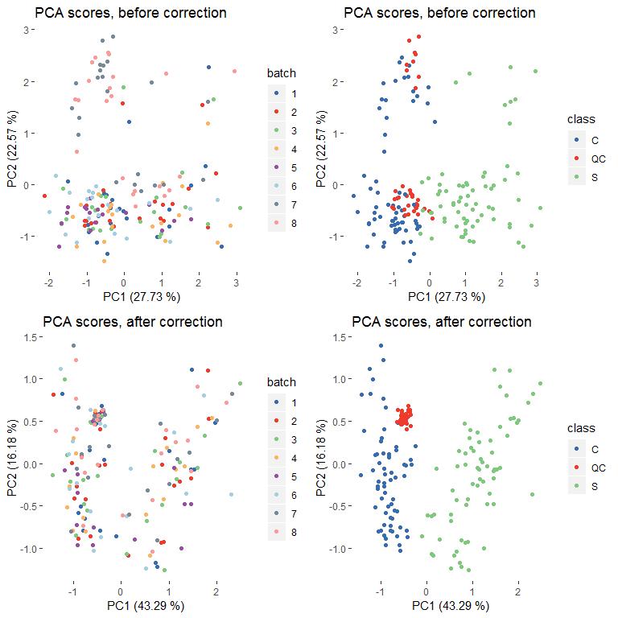
